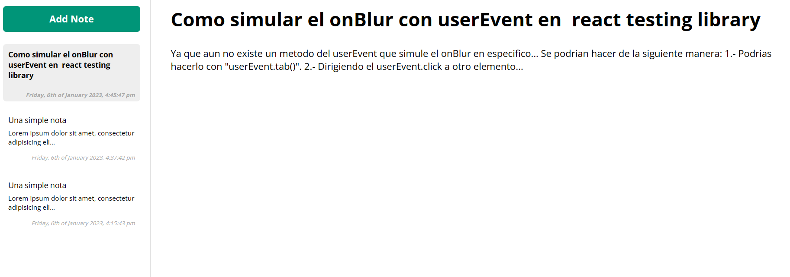

# Note-app

La "Note-app" es una aplicacion web muy util que te permite guardar notas simples y putuales para que puedas recordar ciertos datos que desees y tenerlas siempre a la mano para la ocasion. se almacenara en el lado izquierdo en un sidebar donde podras accder a cualquier nota que hayas añadido y con un doble click sobre el card seleccionado, podras eliminarlo por si accidentalemente agregas una nota

## ¿Como usar "Note-app"?

- Hacer click en el button "Add Note".
- Hacer click en el titulo o parrafo por defecto que se encuentran de color plomo e ingresar lo que desee escribir (al hacer click en otro elemento lo ingresado se guardara en el card, se actualizara la fecha y se pone primero en la lista)
- Si desea eliminar una nota, hacer doble click en el card del lado izquierdo y confirmar el borrado.
